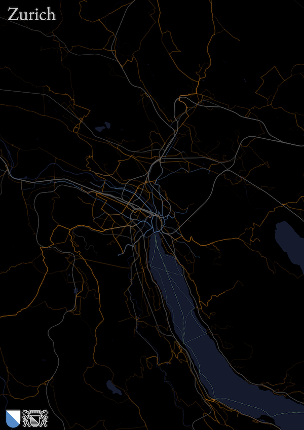
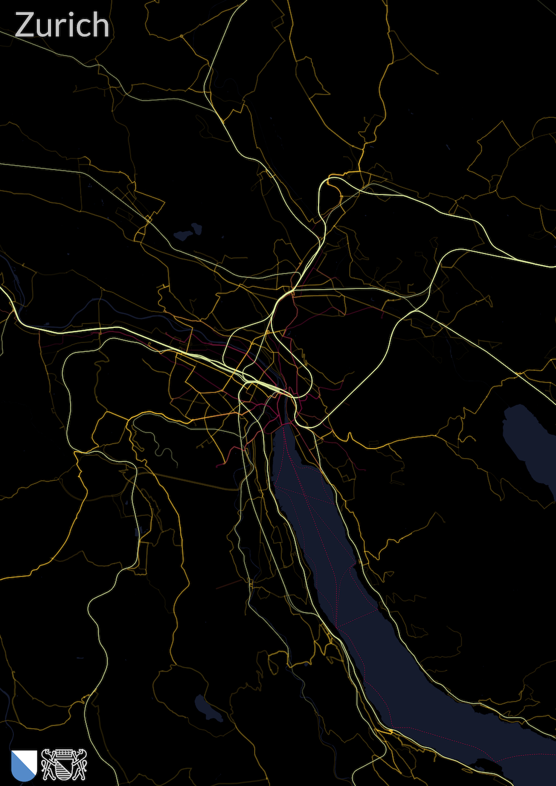
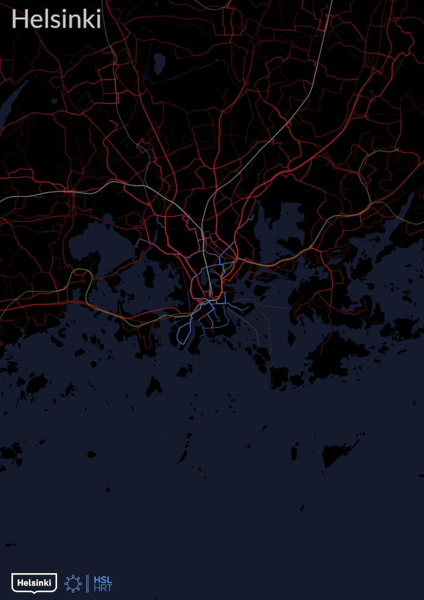
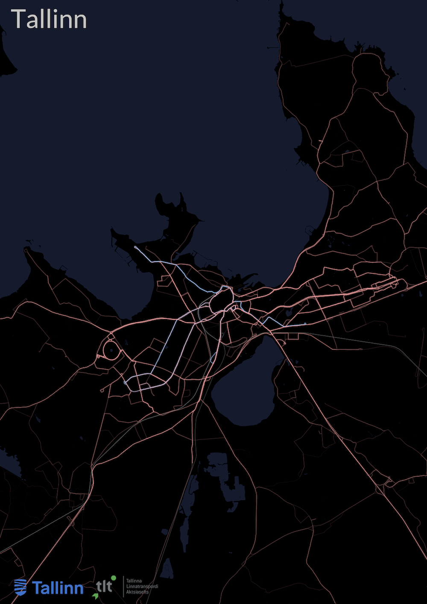
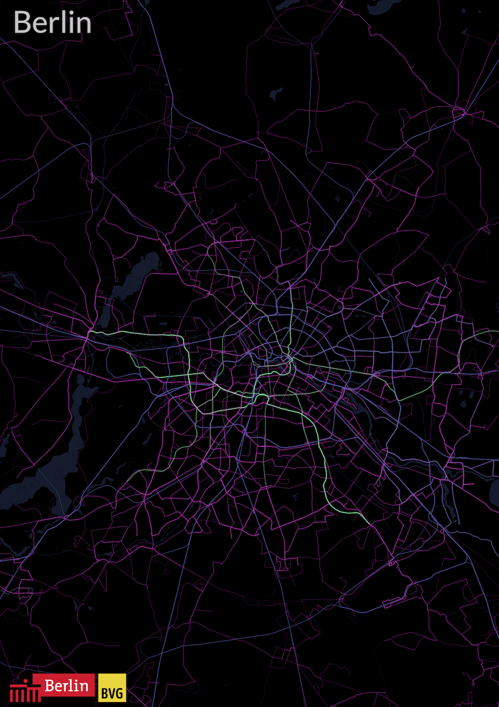

<p align="middle">

</p>

# Cityliner

This project aims to create colorful visualizations from GTFS (General Transit Feed Specification) public transport datasets.
It illustrates public transport routes on a map, where the thickness and opacity of the lines
are determined by the frequency of the schedules along that route segment.
Each primary mode of transportation, as defined in GTFS terms, is represented by a unique color.

## Table of Contents

1. [Features](#features)
2. [Installation and Setup](#installation-and-setup)
3. [Usage](#usage)
4. [Gallery](#gallery)
5. [Contribution](#contribution)
6. [License](#license)
7. [Acknowledgements](#acknowledgements)

## Features

- Visualize GTFS routes based on their frequency and route types.
- Renders result as a PDF.
- Multiple color schemes: default, pastel, inferno, earthy, cool.
- Water body visualization (beta).

## Installation and Setup

1. Clone this repository:
    ```shell
    git clone git@github.com:dragoon/cityliner.git
    cd cityliner
    ```
2. Install required dependencies:
   ```shell
   pip install -r requirements.txt
   ```
3. Download Ocean shape file from OpenStreetMap: https://osmdata.openstreetmap.de/data/water-polygons.html (WGS84 Projection) and unzip it into the `oceans` directory.
4. Download GTFS data with ``shapes.txt`` file available, see catalog here: https://github.com/MobilityData/mobility-database-catalogs.
   And place it under ``gtfs/[place_name]/**``
5. Download some city/transport company logos if needed and place into ``assets/logos/[place_name]/**``.

## Usage
Run the script using the following command:
```shell
python main.py --gtfs gtfs/[place_name] --center [center_coordinates] --poster [other_options]
```

### Options:
- `--gtfs`: Path to the GTFS directory. **(Required)**
- `--processed-dir`: Path to the directory with intermediate files (defaults to ``./processed``).
- `--center`: Coordinates of the center in the format `latitude,longitude`. **(Required)**
- `--max-dist`: Maximum distance from the center on y-axis (in km). Default is 20 km.
- `--size`: Size of the output drawing (in px). **(Either `--size` or `--poster` must be provided)**
- `--poster`: Create a drawing for A0 poster size.
- `--water`: Add water bodies to the poster (beta).
- `--color-scheme`: Choose a color scheme for the poster. Allowed values are: `default`, `pastel`, `inferno`, `earthy`, `cool`. Default is `default`.

Example Helsinki:
```shell
python main.py --gtfs ./gtfs/helsinki --center 60.1706017,24.9414482 --poster --color-scheme pastel --water
```
See configs from other cities in https://github.com/dragoon/cityliner/blob/master/citylines/process_configs.py

## Gallery

<p align="middle">


</p>

<p align="middle">


</p>


## Contribution

Feel free to fork this repository, open issues, or submit pull requests. Any contribution is welcome!

## License

### Gallery

	The gallery photos are licensed under the Creative Commons Attribution
	4.0 International license: http://creativecommons.org/licenses/by/4.0/.

### Code

This source code is licensed under GNU GPLv3. See the `LICENSE` file for more details.

    Copyright (c) 2023
	Roman Prokofyev <https://prokofyev.ch/>

## Acknowledgements
This project is inspired by Michael Mueller's [gtfs-visualizations](https://github.com/cmichi/gtfs-visualizations) repository (implemented with Node.js and Processing),
and my fork: https://github.com/dragoon/gtfs-visualizations,
which allowed to process large GTFS files, added actual poster-generation code,
and a possibility to restrict the visualization area within a certain radius, among other improvements.

This implementation has been designed from scratch with Python,
with ReportLab used for PDF rendering, and adds a possibility to visualize water bodies using OpenSteetMap data, among other changes.


