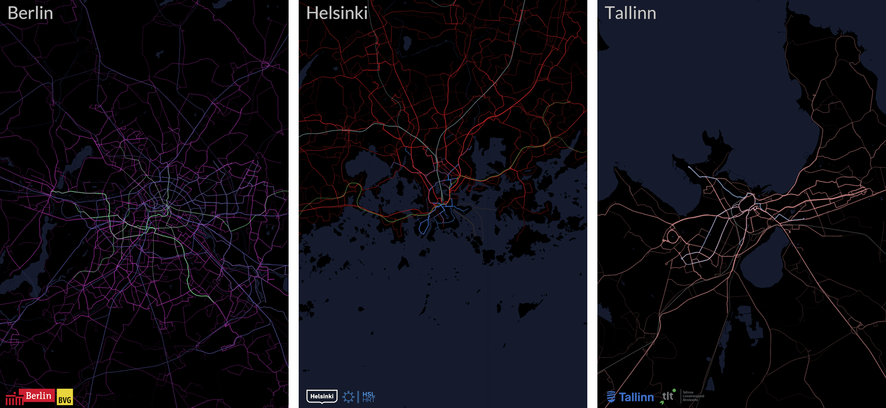
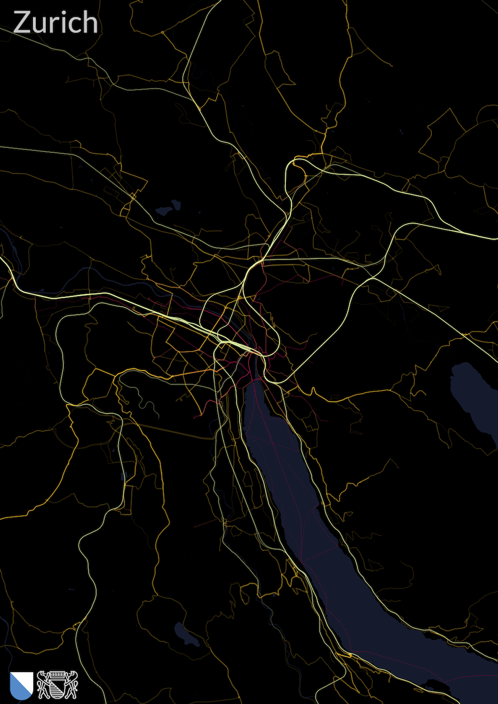
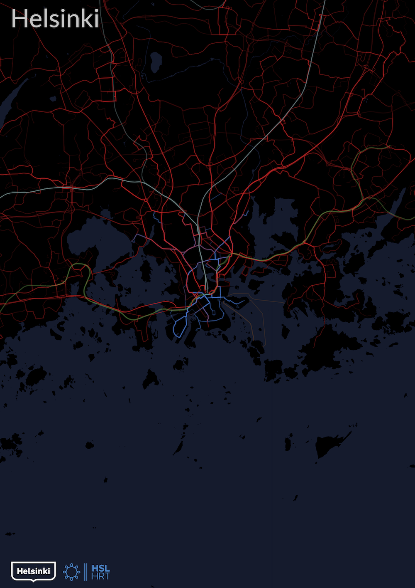
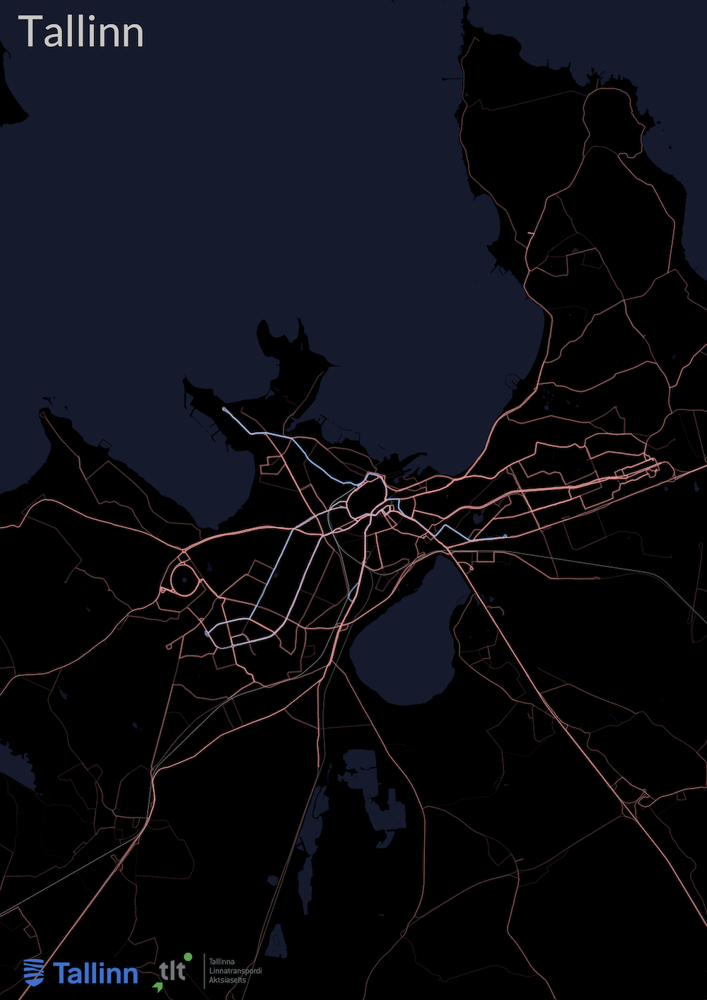
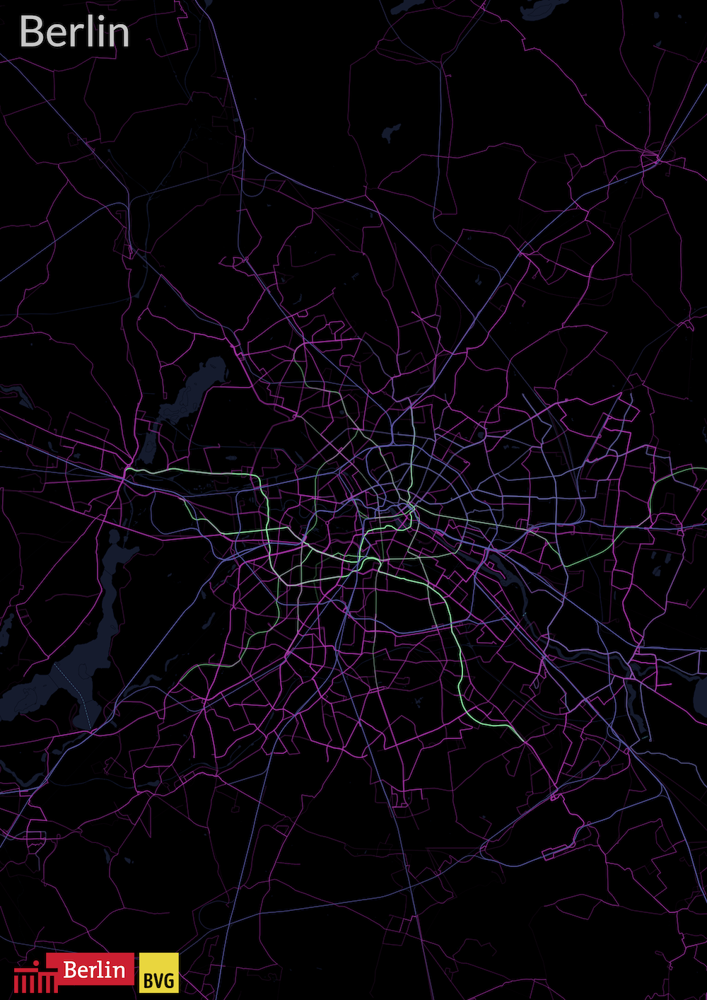

# Cityliner



Cityliner turns public transport schedules into high-resolution city posters.
It reads GTFS (General Transit Feed Specification) feeds and draws route segments on a map.
Line thickness and opacity show how often vehicles run there.

Use it to see which corridors carry the city, where the network thins out, and how rail, tram,
bus, ferry, and cable routes fit together.

## Actions

- **Generate a poster:** bring a GTFS feed and export a high-resolution PDF.
- **[Build the Time Explorer](docs/explore/README.md):** export seven days of scheduled service into a static, interactive city map.
- **[Open the showcase](https://cityliner.prokofyev.ch/):** see example posters and commercial options.
- **[Open a city request](https://github.com/dragoon/cityliner/issues/new?template=city_request.yml):** include the city, GTFS source, center coordinates, and whether the feed has `shapes.txt`.
- **[Commission a print-ready poster](https://prokofyev.ch/):** request custom city, region, or transit-network work.
- **Add a city config:** add a repeatable setup for another city and submit a pull request.

## Public Project and Commercial Use

This repository contains the open-source Cityliner engine. It does not include raw GTFS feeds,
private processing caches, print masters, customer files, or commercial workflow.
Selected derived schedule archives and their attribution are included under `docs/explore/data`.

The code is GPLv3. Gallery images are Creative Commons Attribution 4.0 unless noted otherwise.
GTFS feeds, map data, city/agency logos, and transit brand marks can have their own licenses and
permissions. For commercial posters, use logo-free layouts unless you have explicit
permission to use the relevant marks.

## Table of Contents

1. [Actions](#actions)
2. [Public Project and Commercial Use](#public-project-and-commercial-use)
3. [Features](#features)
4. [Installation and Setup](#installation-and-setup)
5. [Usage](#usage)
6. [Gallery](#gallery)
7. [Contribution](#contribution)
8. [License](#license)
9. [Acknowledgements](#acknowledgements)

## Features

- Draw GTFS routes by frequency and route type.
- Export a high-resolution PDF.
- Multiple color schemes: default, pastel, inferno, earthy, cool.
- Water body visualization (beta).
- Administrative borders (beta).
- Static Time Explorer: local stop-to-stop timing, a 15-minute slider, playback,
  mode filters, shareable views, and credited PNG downloads. See the
  [export guide](docs/explore/README.md), [data sources](docs/explore/SOURCES.md),
  and [testing guide](docs/explore/TESTING.md).

## Installation and Setup

1. Clone this repository:
    ```shell
    git clone git@github.com:dragoon/cityliner.git
    cd cityliner
    ```
2. Install required dependencies:
   ```shell
   pip install -r requirements.txt
   ```
3. Download the ocean shape file from OpenStreetMap: https://osmdata.openstreetmap.de/data/water-polygons.html (WGS84 projection) and unzip it into the `oceans` directory.
4. Download GTFS data with `shapes.txt`. Start with the MobilityData catalog: https://github.com/MobilityData/mobility-database-catalogs.
   Place the feed under `gtfs/[place-name]/**`.
5. Add city or transport agency logos only if you have permission to use them, and place them under ``assets/logos/[place-name]/**``.

## Usage
Run:
```shell
python main.py --gtfs gtfs/[place-name] --center [center_coordinates] --poster [other_options]
```

### Options:
- `--gtfs`: Path to the GTFS directory. **(Required)**
- `--processed-dir`: Path to the directory with intermediate files (defaults to ``./processed``).
- `--center`: Coordinates of the center in the format `latitude,longitude`. **(Required)**
- `--max-dist`: Maximum distance from the center on y-axis (in km). Default is 20 km.
- `--width`: Width of the output drawing (in px).
- `--height`: Height of the output drawing (in px)
- `--poster`: Create a drawing for A0 poster size.
- `--water`: Plot water bodies (beta).
- `--admin-borders`: Plot administrative borders of the city/region determined by the center coordinates (beta).
- `--color-scheme`: Choose a color scheme for the poster. Allowed values are: `default`, `pastel`, `inferno`, `earthy`, `cool`. Default is `default`.
- `--logos`: List of logos for the poster (inside `./assets/logos/{place-name}/`)

**(Either `--width` and `--height` or `--poster` must be provided)**

Example Helsinki:
```shell
python main.py --gtfs=./gtfs/helsinki --place-name=helsinki --center=60.1706017,24.9414482 --poster --color-scheme=pastel --water --logos "helsinki.svg" "hsl.svg"
```
See city configs in https://github.com/dragoon/cityliner/blob/master/citylines/process_configs.py

## Gallery

Line weight and opacity show service frequency on each route segment.

<p align="middle">


</p>

<p align="middle">


</p>


## Contribution

Forks, issues, and pull requests are welcome. Useful contributions include city configs,
setup fixes, color schemes, preview generation, and license notes for public data sources.

For city requests, [open an issue](https://github.com/dragoon/cityliner/issues/new?template=city_request.yml) with the city name,
GTFS source, center coordinates, and whether the feed includes `shapes.txt`.

## License

### Gallery

	The gallery photos are licensed under the Creative Commons Attribution
	4.0 International license: http://creativecommons.org/licenses/by/4.0/.

### Code

This source code is licensed under GNU GPLv3. See the `LICENSE` file for more details.

    Copyright (c) 2023
	Roman Prokofyev <https://prokofyev.ch/>

## Acknowledgements
This project is inspired by Michael Mueller's [gtfs-visualizations](https://github.com/cmichi/gtfs-visualizations) project, implemented with Node.js and [Processing](https://processing.org/), and my fork: https://github.com/dragoon/gtfs-visualizations,
which allowed to process large GTFS files, added actual poster-generation code,
and a possibility to restrict the visualization area within a certain radius, among other improvements.

This implementation has been developed from scratch with Python,
ReportLab for PDF rendering, different color palettes, and a possibility to visualize water bodies using OpenSteetMap data, among other changes.
